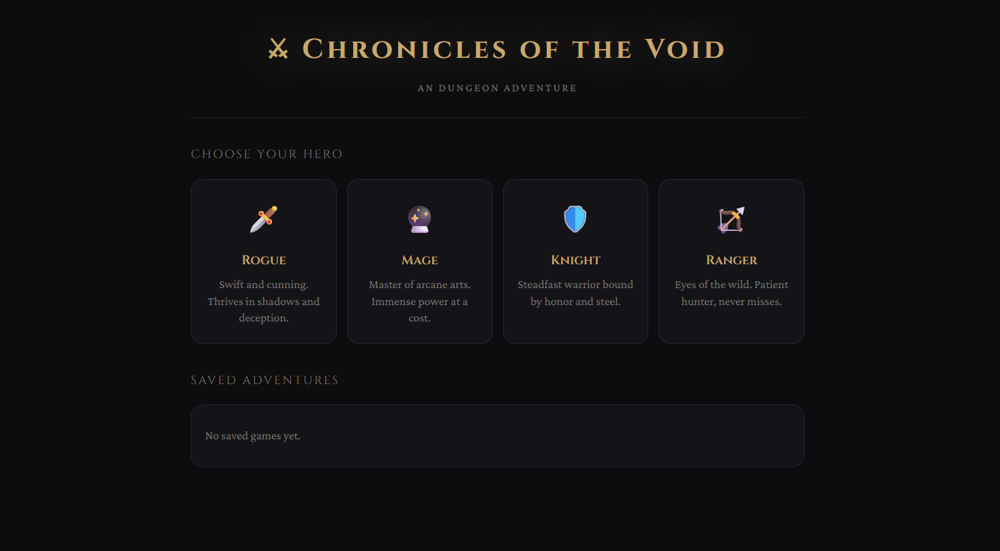

# ⚔️ Chronicles of the Void — AI Dungeon Game

A full-stack dungeon adventure game using **Groq API**, **Express.js**, and **MySQL**.


---

## 📁 Project Structure

```
ai-dungeon/
├── backend/
│   ├── db/
│   │   └── schema.sql        # MySQL schema
│   ├── routes/
│   │   └── game.js           # API routes
│   ├── controllers/
│   │   └── gameController.js # Business logic + Groq API
│   ├── .env                  # Your secrets (never commit this!)
│   ├── server.js             # Express entry point
│   └── package.json
├── frontend/
│   ├── css/
│   │   └── style.css
│   ├── js/
│   │   └── game.js
│   └── index.html
└── README.md
```

---

## ⚙️ Setup

### 1. Install backend dependencies
```bash
cd backend
npm install
```

### 2. Create your MySQL database
```bash
mysql -u root -p
```
Then run:
```sql
CREATE DATABASE ai_dungeon;
USE ai_dungeon;
SOURCE db/schema.sql;
```


Get your free Groq API key at: https://console.groq.com

### 4. Start the backend
```bash
cd backend
npm run dev
```

### 5. Open the frontend
Open `frontend/index.html` directly in your browser, or serve it:
```bash
npx serve frontend
```

---

## 🎮 Features

- 4 character classes: Rogue, Mage, Knight, Ranger
- AI-generated story scenes, choices, and events via Groq
- HP, XP, and location tracking
- Save/load game sessions in MySQL
- Custom player actions (free text input)
- Event types: Combat, Exploration, Loot, Story

---

## 🔌 API Endpoints

| Method | Endpoint | Description |
|--------|----------|-------------|
| POST | `/api/game/start` | Start a new game session |
| POST | `/api/game/action` | Send a player action, get AI response |
| GET | `/api/game/session/:id` | Load a saved session |
| GET | `/api/game/sessions` | List all saved sessions |

---

## 🛠️ Tech Stack

- **Frontend:** HTML, CSS, Vanilla JS
- **Backend:** Node.js + Express.js
- **AI:** Groq API (llama-3.3-70b-versatile)
- **Database:** MySQL
